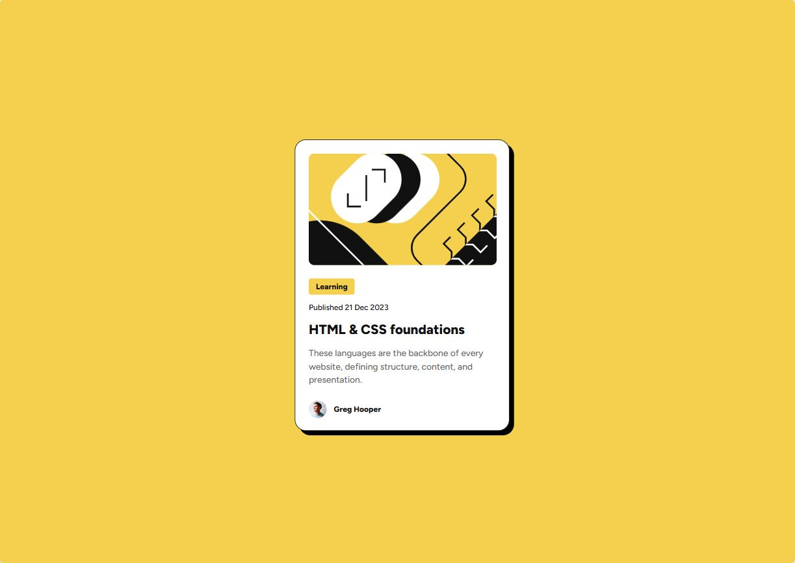
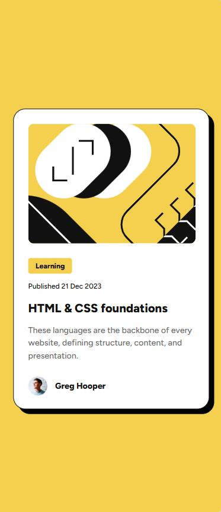

# Frontend Mentor - Blog preview card solution

This is a solution to the [Blog preview card challenge on Frontend Mentor](https://www.frontendmentor.io/challenges/blog-preview-card-ckPaj01IcS). Frontend Mentor challenges help you improve your coding skills by building realistic projects. 

## Table of contents

- [Overview](#overview)
  - [The challenge](#the-challenge)
  - [Screenshots](#screenshot)
  - [Links](#links)
- [My process](#my-process)
  - [Built with](#built-with)
  - [What I learned](#what-i-learned)
- [Author](#author)

## Overview

### The challenge

Users should be able to:

- See hover and focus states for all interactive elements on the page

### Screenshots

### Links

- Solution URL: [Solution](https://www.frontendmentor.io/solutions/responsive-blog-preview-card-ZlixLKI527)
- Live Site URL: [Live site](https://daydream-softworks.github.io/Blog-Preview-Card/)

## My process

### Built with

- Semantic HTML5 markup
- CSS custom properties
- Flexbox
- Mobile-first workflow

### What I learned

-I learned how to utilize media queries to implement responsive design strategies. 
-I learned how to leverage CSS variables for consistent theming and styling across design files. 
-I learned how to use the overflow property to manage and conceal content that extends beyond an element's boundaries. 
-I learned how to apply the object-fit property to control the sizing and aspect ratio of replaced elements, ensuring optimal presentation.

## Author

- Frontend Mentor - [@Daydream-Softworks](https://www.frontendmentor.io/profile/Daydream-Softworks)
- LinkedIn - [@NelsonMontesinos](www.linkedin.com/in/njmontesinos)

